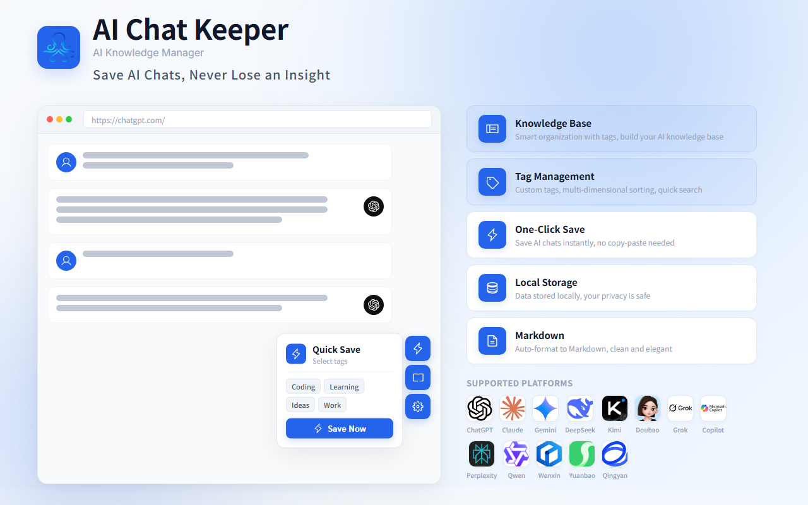

  <a href="https://aichatkeeper.com/en/">English</a> ·
  <a href="https://aichatkeeper.com/zh/">中文</a> ·
  <a href="README_zh.md">中文文档</a>

  

<h1 align="center">AI Chat Keeper</h1>

<strong>Save Your AI Chats. Never Lose an Insight.</strong>

  
  
  
  

  

> ⚠️ **This repository is a community hub** for issues, feature requests, and discussions. AI Chat Keeper is **free to use**, but the extension source code is **not open source**.

  
  &nbsp;&nbsp;
  

---

## 🤔 Why AI Chat Keeper?

We use AI chats every day — ChatGPT, Claude, DeepSeek, and more. The best conversations kept getting lost across platforms. No tool let us save and organize them all in one place. So we built one.

| ❌ Before | ✅ After |
|:----------|:---------|
| Conversations scattered across 13+ platforms | One extension to capture them all |
| Valuable replies buried in chat history | Auto Markdown formatting, ready to reuse |
| Data on someone else's cloud | 100% local storage — no signup needed |

---

## 🚀 Quick Start

  <b>① Install</b> → <b>② Capture</b> → <b>③ Manage</b>

1. **Install** from [Chrome Web Store]() or [Edge Add-ons]()
2. **Open** ChatGPT, Claude, Gemini, DeepSeek, or any supported AI platform and start a conversation
3. **Capture** — click the copy button for auto-capture, or open the floating bar for one-click batch extraction
4. **Manage** — search, tag, and export everything from the extension's knowledge base

---

## ✨ Core Features

| Feature | Description |
|:--------|:------------|
| 🎯 **13 Platforms** | ChatGPT, Claude, Gemini, Grok, Perplexity, Microsoft Copilot, Doubao, DeepSeek, Kimi, Qwen, Yuanbao, ERNIE Bot, Zhipu Qingyan |
| 📋 **Two Capture Modes** | Copy-capture auto-detects clipboard content; floating bar extracts entire conversations in one click |
| 📝 **Auto Markdown Format** | Standard Markdown with syntax highlighting and table support — works seamlessly with Notion, Obsidian, and more |
| 🏷️ **Smart Tags** | Auto-tagging by platform + custom tags; filter by tags, keywords, and platform categories |
| 🔍 **Full-Text Search** | Local indexing with millisecond response — find any conversation instantly |
| 🔒 **Local First** | All data stored in IndexedDB; nothing uploaded to any server; no account registration required |
| 📦 **Export & Backup** | Export in Markdown or JSON; full ZIP backup with one-click restore |

---

## ❓ FAQ

<strong>Do I need to create an account?</strong>

No. AI Chat Keeper requires no registration — install and use immediately. All data is stored locally in your browser.

<strong>Is my data secure?</strong>

Absolutely. All conversation data stays in your browser's local IndexedDB. We never upload anything to the cloud.

<strong>Is it really free?</strong>

Yes. AI Chat Keeper is completely free. All core features are unlimited.

<strong>What export formats are supported?</strong>

Markdown and JSON for individual or batch exports, plus ZIP format for full backup and restore.

<strong>Which browsers are supported?</strong>

Chrome and Edge. Both are fully supported with the same feature set.

<strong>Is the source code open source?</strong>

No. The extension is free but proprietary. This repository is for community feedback, bug reports, and feature discussions.

---

## 🤝 Community & Feedback

Your voice shapes the product. Here's how to reach us:

| Channel | Purpose |
|:--------|:--------|
| 🐛 [**Issues**](https://github.com/aichatkeeper/ai-chat-keeper-extension/issues) | Bug reports & feature requests |
| 💬 [**Discussions**](https://github.com/aichatkeeper/ai-chat-keeper-extension/discussions) | Q&A, ideas, and community chat |

---

## 🔗 Links

- 🌐 [Website (EN)](https://aichatkeeper.com/en/)
- 🌐 [官网 (中文)](https://aichatkeeper.com/zh/)
- 📦 [GitHub Repository](https://github.com/aichatkeeper/ai-chat-keeper-extension)

---

## 📄 License

- **Documentation & assets** in this repository: [CC BY 4.0](https://creativecommons.org/licenses/by/4.0/)
- **AI Chat Keeper extension code**: Proprietary — all rights reserved

  Made with ❤️ by the AI Chat Keeper team

