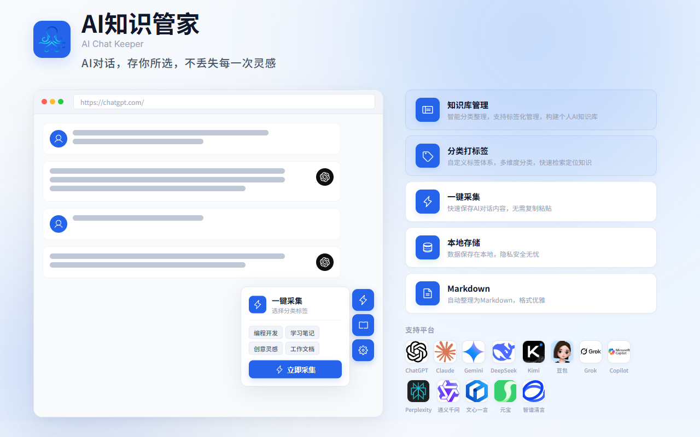

  <a href="README.md">English</a> ·
  <a href="https://aichatkeeper.com/zh/">中文官网</a> ·
  <a href="https://aichatkeeper.com/en/">English Site</a>

  

<h1 align="center">AI Chat Keeper</h1>

<strong>保存你的每一次 AI 对话，让灵感永不丢失。</strong>

  
  
  
  

  

> ⚠️ **本仓库是社区交流平台**，用于收集用户反馈、功能建议和讨论交流。AI Chat Keeper 浏览器扩展**完全免费使用**，但源代码**暂不开源**。

  
  &nbsp;&nbsp;
  

---

## 🤔 为什么做 AI Chat Keeper？

我们自己就是重度 AI 用户，每天在 ChatGPT、Claude、DeepSeek、豆包等多个平台之间切换。最有价值的对话经常淹没在聊天记录里，找不到、用不上。市面没有一个工具能跨平台统一管理 AI 对话，于是我们自己做了一个。

| ❌ 以前 | ✅ 现在 |
|:--------|:---------|
| 对话分散在 13+ 个平台，回顾困难 | 一个扩展统一捕获，随时回顾 |
| 好回复淹没在聊天流中 | Markdown 自动格式化，即存即用 |
| 数据在云端，隐私不受控 | 纯本地存储，无需注册，你的数据你做主 |

---

## 🚀 快速开始

  <b>① 安装</b> → <b>② 捕获</b> → <b>③ 管理</b>

1. **安装**：从 [Chrome 网上应用店]() 或 [Edge 加载项]() 安装扩展
2. **捕获**：打开 ChatGPT、Claude、DeepSeek、豆包等任意支持的 AI 平台开始对话，点击**复制按钮**自动捕获，或打开**悬浮栏**一键批量提取
3. **管理**：在扩展知识库中搜索、打标签、导出，一切尽在掌握

---

## ✨ 核心功能

| 功能 | 说明 |
|:------|:------|
| 🎯 **13 个主流平台** | ChatGPT、Claude、Gemini、Grok、Perplexity、Microsoft Copilot、豆包、DeepSeek、Kimi、通义千问、元宝、文心一言、智谱清言 |
| 📋 **两种捕获模式** | 复制捕获：点击复制按钮自动检测保存；悬浮栏一键批量提取整个对话 |
| 📝 **自动 Markdown 格式** | 标准 Markdown 格式，支持代码高亮和表格，无缝兼容 Notion、Obsidian 等笔记工具 |
| 🏷️ **智能标签** | 按平台自动标签 + 自定义标签，支持标签 + 关键词双维度筛选 |
| 🔍 **全文搜索** | 本地索引，毫秒级响应，像搜索本地文件一样快 |
| 🔒 **本地优先** | 所有数据存入浏览器 IndexedDB，不上传任何服务器，无需注册 |
| 📦 **导出 & 备份** | 支持 Markdown / JSON 导出，一键 ZIP 全量备份与恢复 |

---

## ❓ 常见问题

<strong>需要注册账号吗？</strong>

不需要。AI Chat Keeper 无需注册，安装即用。所有数据存储在浏览器本地。

<strong>我的数据安全吗？</strong>

绝对安全。所有对话数据存储在浏览器的本地 IndexedDB 中，不会上传到任何服务器。

<strong>真的免费吗？</strong>

是的，AI Chat Keeper 完全免费，所有核心功能无任何限制。

<strong>支持哪些导出格式？</strong>

支持 Markdown 和 JSON 格式的单条或批量导出，以及 ZIP 格式的全量备份与恢复。

<strong>支持哪些浏览器？</strong>

Chrome 和 Edge，两个平台功能完全一致。

<strong>源代码开源吗？</strong>

暂不开源。扩展免费使用，本仓库用于收集用户反馈、功能建议和社区交流。

---

## 🤝 社区 & 反馈

你的声音决定产品的方向。参与方式：

| 渠道 | 用途 |
|:------|:------|
| 🐛 [**Issues**](https://github.com/aichatkeeper/ai-chat-keeper-extension/issues) | 提交 Bug 报告 & 功能建议 |
| 💬 [**Discussions**](https://github.com/aichatkeeper/ai-chat-keeper-extension/discussions) | 问答交流、产品想法、社区互动 |

---

## 🔗 相关链接

- 🌐 [中文官网](https://aichatkeeper.com/zh/)
- 🌐 [English Website](https://aichatkeeper.com/en/)
- 📦 [GitHub 仓库](https://github.com/aichatkeeper/ai-chat-keeper-extension)

---

## 📄 许可协议

- 本仓库的**文档及素材**：[CC BY 4.0](https://creativecommons.org/licenses/by/4.0/)
- **AI Chat Keeper 扩展代码**：Proprietary — 保留所有权利

  AI Chat Keeper 团队 ❤️ 出品

